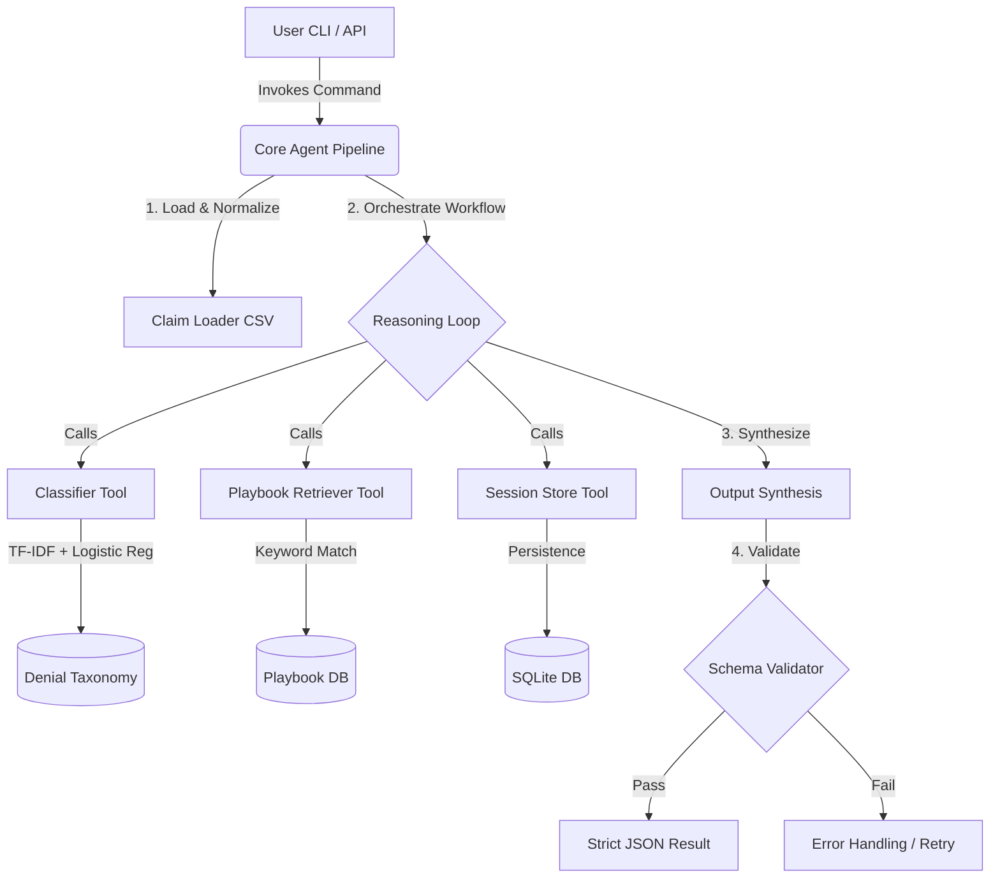

# 
✨ Lakshmi Sowjanya Bhagodula ✨

  

  
  
  

---

## ⚡ Executive Summary
Experienced **AI/ML Engineer (5+ Years)** with a specialized focus on **Generative AI (3+ Years)**. I bridge the gap between cutting-edge LLM research and production-grade enterprise systems. My expertise lies in architecting **Agentic AI** using multi-agent orchestration (LangGraph) and high-performance **RAG pipelines**.

> "Building autonomous intelligence that doesn't just predict the next word, but executes the next action."

- **Current Focus:** Autonomous agent systems with stateful memory and dynamic tool-calling.
- **Enterprise Impact:** Improved response accuracy by **35%** at US Bank via advanced RAG optimization.
- **Academic Background:** M.S. in Computer Science from Texas Tech University.

---

## 🛠️ Technical Powerhouse

### 🧠 Generative AI & Core Intelligence

| Domain | Technologies |
| :--- | :--- |
| **Generative AI** | LangGraph, LLaMA-3, Claude, Gemini, RAG, MCP, CrewAI |
| **Machine Learning** | Scikit-learn, XGBoost, Reinforcement Learning, TensorFlow |
| **LLM Ops / Tuning** | LoRA, PEFT, Prompt Engineering (CoT/Few-Shot), MLflow, W&B |
| **Data & Vectors** | Pinecone, OpenSearch, Azure AI Search, FAISS, PySpark, SQL |
| **Cloud & DevOps** | Azure ML, AWS SageMaker, GCP Vertex AI, Docker, Kubernetes, Terraform |
| **Engineering** | FastAPI, Flask, CI/CD, Prometheus, Grafana |

---

## 📈 Professional Trajectory

#### **GenAI Engineer | US Bank** *July 2024 – Present*
- Deployed Agentic AI systems using **LangGraph** for autonomous task execution.
- Fine-tuned **Llama-2** and **Gemma** for enterprise workloads using LoRA/PEFT.
- Built multimodal pipelines processing text, PDFs, and images via OCR and LLM-retrieval.

#### **Research Engineer | Texas Tech University**
*Sept 2022 – May 2024*
- Developed RL-based decision-making workflows and scalable NLP microservices.
- Automated end-to-end MLOps pipelines using GitHub Actions and MLflow.

#### **Data Scientist | Tata Consultancy Services (TCS)**
*Jan 2020 – Aug 2022*
- Increased user engagement by **15%** via collaborative filtering recommendation systems.
- Boosted CV model accuracy by **18%** for production object detection tasks.

---

## 🚀 Featured Project: Workup Agent: ERISA Denial Analysis System

A production-ready, agentic system designed to analyze medical claim denials subject to ERISA guidelines. This system bridges advanced natural language synthesis with deterministic, auditable machine learning classifiers to simulate a highly specialized human claims analyst.

## 🏗️ System Architecture & Data Flow

This project utilizes a **Tool-Augmented Reasoning** paradigm, allowing an LLM to follow strict decision trees while dynamically calling isolated programmatic tools.

---

## 📫 Let's Build Something Intelligent
I am always looking to discuss **Agentic AI frameworks**, **LLM Fine-tuning**, or **Responsible AI**. 

- **Location:** Liberty Hill, TX (Open to Remote)
- **Website:** [lsbhogadula.org](https://lsbhogadula.org)
- **Fun Fact:** I'm currently experimenting with indoor saffron farming—it's surprisingly similar to tuning an LLM: high sensitivity, specific environments, and great rewards!
